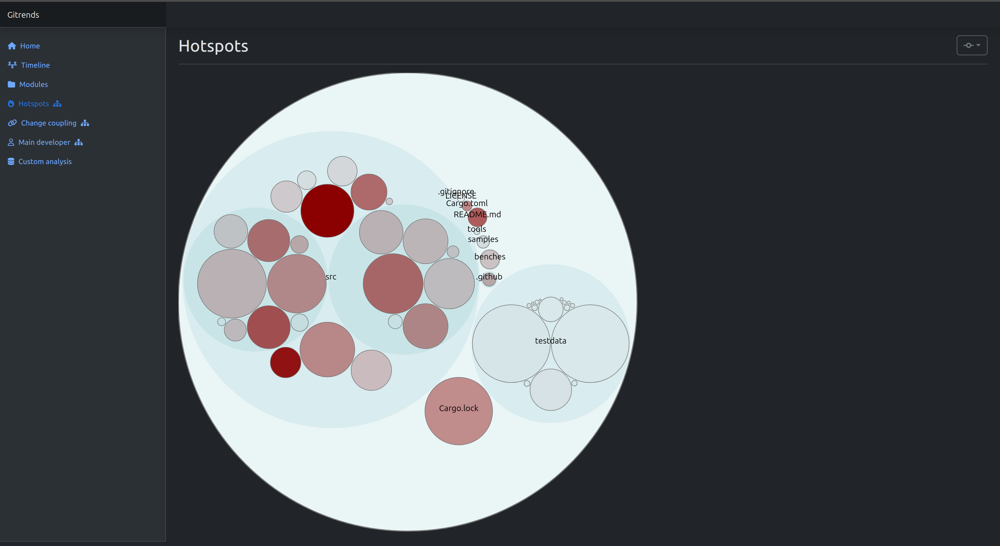

Web-based behavior code analysis tool based on the work by Adam Tornhill in "Your Code as a Crime Scene".

The following behavior code analysis are implemented:

* Module decomposition - breakdown of amount of code by module.
* Hotspots - which file/module is changed most often.
* Change coupling - which file/module are changed together.
* Sum of couplings - total change coupling per file/module.
* Main developer - who has added most lines for file/module.
* Commit spread - spread of commit authors per module.
* Ability to write custom analysis in SQL.



## How to install

### Using debian package
* Install the debian package.
* Run as `gitrends <config>`

### Using docker image
* Run `./build_docker.sh` to build the docker image (produces an image called `gitrends:latest`).
* `$SRC_DIR` should contain a folder that contains source directories to index while `$DATA_DIR` is where output is placed.
* Run as `docker run -it --rm -v $SRC_DIR:/src -v $DATA_DIR:/data -p 9090:9090 gitrends:latest /data/config.yaml`

### Using standalone
* Unzip the prebuilt binaries and frontend in a folder
* Run as `./gitnotes <config>`.

## How to use
The application is configured through a YAML file:
```yaml
source_dir: /home/antjans/Code/sqlgrep
data_dir: data/sqlgrep
listen: 0.0.0.0:9090 # If running in docker
```

* `source_dir` is the repository to index.
* `data_dir` is where the index of the repository is placed at.

After indexing, the program no longer need to access the repository, and no source code is extracted to the index (code statistics are though).

After running the application (see above), browse to http://localhost:9090 to access the tool.

### Module definitions
The `modules.txt` file in the `data_dir` allows you to define the module structure of your repository.

```text
src/model.rs => model
src/data_model.rs => model

src/parsing/**/* => parsing

src/execution/**/* => execution
src/executor.rs => execution

src/integration_tests.rs => tests
testdata => tests

src/main.rs => cli
src/table_editor.rs => cli

src/python_wrapper => lib

Cargo* => build
.github/workflows/**/* => ci
```

If a file don't match above patterns, the folder of the file will be used as module instead.

When writing custom analysis, the function `extract_module_name` can then be used to extract the module name of a file.

### Ignore files
The `ignore.txt` file in the `data_dir` allows you to ignore certain files from being used in the analysis (they are still indexed, so no reindexing required when changing).

```text
src/*.rs
```

### Authors
The `authors.txt` file in the `data_dir` allows you to normalize the authors of commits (such that just one name is used).

```text
antjans => Anton Jansson
```

## How to build
Requirements:
* `cargo` (https://rustup.rs/)
* `yarn` (https://yarnpkg.com/getting-started/install)

Run `./build_deb.sh` to build the Debian package.

## Implementation details
The data from the git log and source code analysis is extracted as Parquet files which then is used by Apache DataFusion to provide querying of the git data.
This allows most of the analysis to be implemented as SQL queries. In addition, this allows a user of the tool to write custom SQL queries of the same data.

## Logo
Logo inspired by the Git logo - see https://git-scm.com/downloads/logos.
