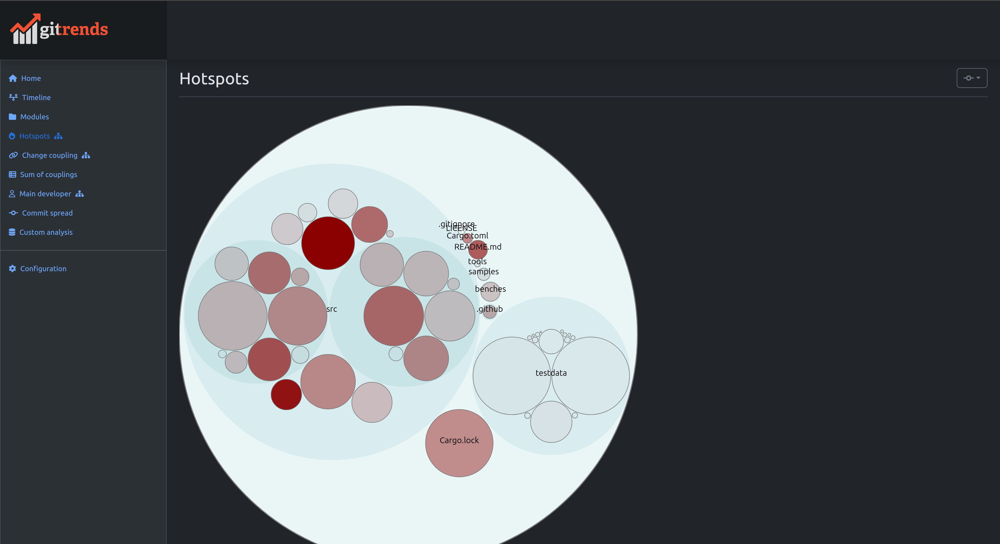

Web-based behavior code analysis tool based on the work by Adam Tornhill in "Your Code as a Crime Scene".

Implemented analysis:

* Module decomposition
* Hotspot
* Change coupling
* Main developer
* Custom analysis in SQL



## How to install

### Using debian package
* Install the debian package from the released artifacts.
* Run as `gitrends <config>`

### Using docker image
* Run `./build_docker.sh` to build the docker image (`gitrends:latest`).
* `$SRC_DIR` should contain a folder that contains source directories while `$DATA_DIR` is where output is placed.
* Run as `docker run -it --rm -v $SRC_DIR:/src -v $DATA_DIR:/data -p 9000:9000 gitrends:latest /data/config.yaml`

## How to use
The configuration is defined in a YAML file:
```yaml
source_dir: /home/antjans/Code/sqlgrep
data_dir: data/sqlgrep
listen: 0.0.0.0:9000 # If running in docker
```

The `source_dir` is the repository to use, and the indexed repository is placed in `data_dir`. After indexing, the program no longer need to access the repository, and no source code is extracted to the index.

Then run `gitrends config.yaml` and then a goto http://localhost:9000 to access the web tool.

### Module definitions
The `modules.txt` file in the `data_dir` allows you to define the module structure of your repository:
```text
src/model.rs => model
src/data_model.rs => model

src/parsing/**/* => parsing

src/execution/**/* => execution
src/executor.rs => execution

src/integration_tests.rs => tests
testdata => tests

src/main.rs => cli
src/table_editor.rs => cli

src/python_wrapper => lib

Cargo* => build
.github/workflows/**/* => ci
```

### Ignore files
The `ignore.txt` file in the `data_dir` allows you to ignore certain files from being used in the analysis (they are still indexed).
```text
src/*.rs
```

### Authors
The `authors.txt` file in the `data_dir` allows you to transform name of authors of commits:
```text
antjans => Anton Jansson
```

## How to build
Requirements:
* `cargo` (https://rustup.rs/)
* `yarn` (https://yarnpkg.com/getting-started/install)

Run `./build_deb.sh` to build the Debian package.

## Implementation details
The data from the git log and source code analysis is extracted as Parquet files which then is used by Apache DataFusion to provide a querying engine on top of this data. 

This allows you to write custom SQL queries to query the underlying git data.

## Logo
Logo inspired by the Git logo - see https://git-scm.com/downloads/logos.